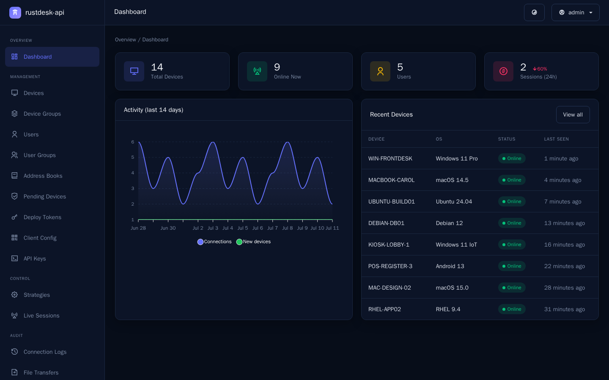
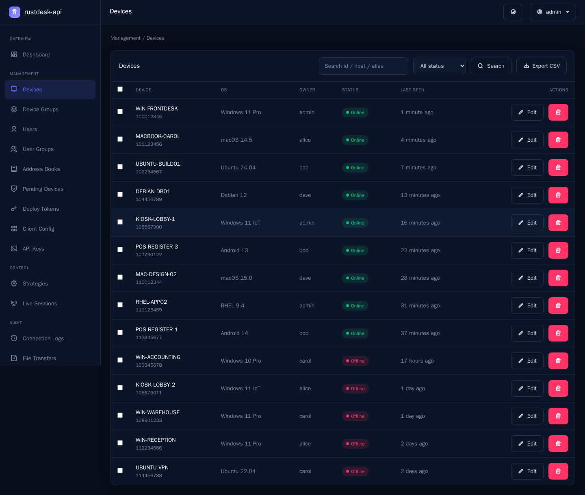
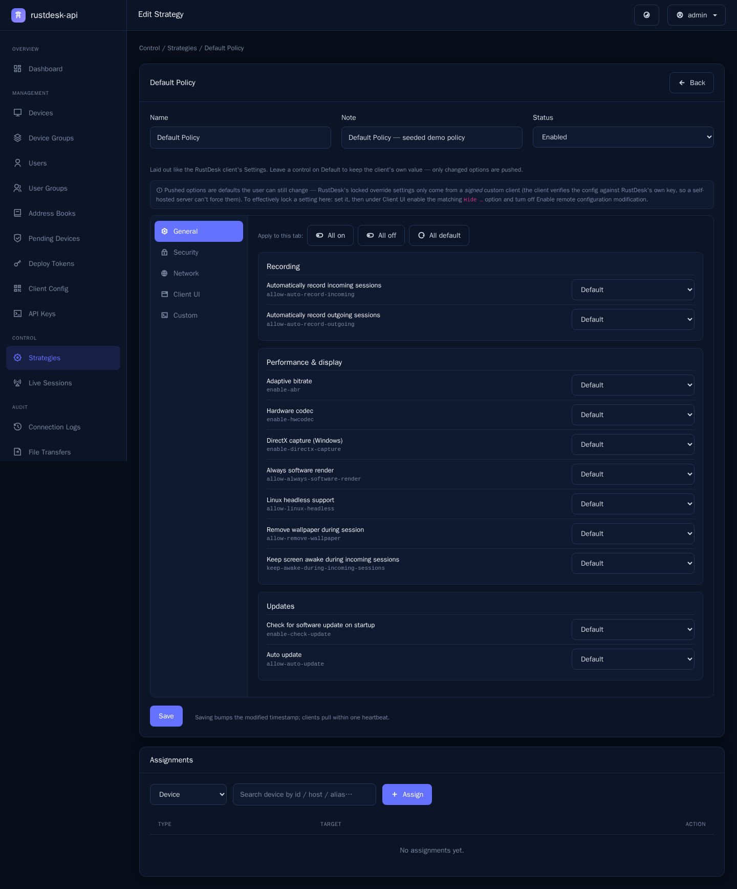
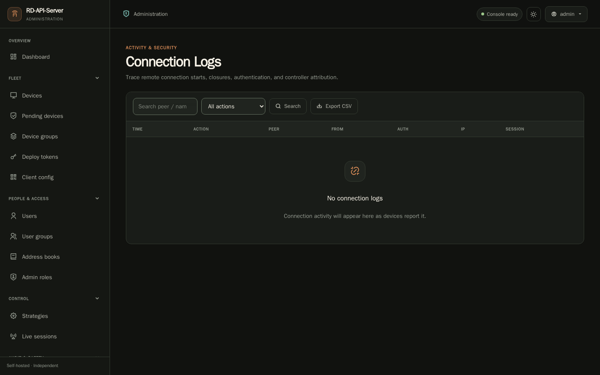
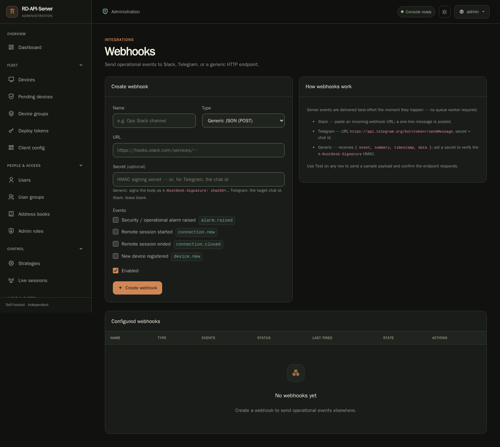

# RD‑API‑Server

**RD‑API‑Server** is a modern, self‑hosted **API server and admin console for
the [RustDesk](https://rustdesk.com) remote‑desktop client** — built in **PHP 8.5 / Laravel**
with a clean **HTML + jQuery + Bootstrap 5** dark dashboard. Runs with one `docker compose`
command, backed by MariaDB.

> ⚠️ **Not affiliated with RustDesk.** This is an **independent, third‑party, open‑source
> project** — **not** an official RustDesk product, nor endorsed by, sponsored by, or connected
> to the RustDesk team or Purslane Ltd. "RustDesk" is a trademark of its respective owner; the
> repo is named **RD‑API‑Server** (shorthand) and references RustDesk only to describe
> compatibility with its open‑source client. This is a **separate implementation** of the
> client's public API, maintained independently.

> 🚧 **Beta — under heavy testing.** This is a young project and many features are still being
> tested and refined, so expect rough edges and occasional breaking changes. If you need
> something production‑ready today, we recommend the established, well‑tested RustDesk API
> servers **`lejianwen/rustdesk-api`** and **`lantongxue/rustdesk-api-server-pro`**.

> Implements the RustDesk client API contract and adds the features the client supports that
> most open‑source API servers don't — including **Strategy (Security‑Settings) push** and
> **device preset auto‑registration**.

## ✨ Features

**Client API (what the RustDesk client talks to)**
- Account login with **2FA** (TOTP + email codes), **OIDC/OAuth** (GitHub, Google, generic
  OIDC) and **LDAP/AD**
- **Heartbeat Strategy push** — remotely manage client security settings (the Pro
  "Settings sync"), with `modified_at` change‑detection and live force‑disconnect
- **Sysinfo + preset auto‑registration** — devices auto‑file into a strategy / device group /
  address book on first contact (`--assign` → `/api/devices/cli`, custom‑client presets)
- Personal **address books** (legacy + Flutter granular transports), tags, end‑of‑connection notes
- **Audit ingestion** (connections incl. RustDesk 1.4.9 auth details, file transfers, security
  alarms) and **session‑recording upload**
- **Device deployment** tokens + approval queue (`/api/devices/deploy`)
- Group endpoints (`/api/users`, `/api/peers`, `/api/device-group/accessible`)

**Admin console (dark dashboard)**
- Dashboard with live stats & charts; brute‑force‑throttled login with optional **TOTP 2FA**
- **Devices** — searchable list with **bulk‑assign** owner / device group / strategy, live‑search pickers
- **Strategies** editor laid out like the RustDesk client's **Settings** (General / Security / Network),
  ~55 catalogued `config_options` with tri‑state toggles + "set all", plus custom keys and
  device/user/group assignment
- **Address Books** — RustDesk‑client‑style manager (peer cards, tags, add/edit dialogs) for **any** user's book,
  with **shared / team books** (collaborators at read · read‑write · full‑control)
- **Webhooks / notifications** — push alarms and connection / device events to **Slack**, **Telegram**,
  or a generic **HMAC‑signed** JSON endpoint, with per‑hook test + delivery status
- **Client Config generator** — produce a server‑config string, mobile **QR**, per‑OS `--config`
  command, and renamed‑installer filename to roll out pre‑configured clients
- **API Keys** — scoped keys for the **admin REST API** (`/api/v1`)
- **Device groups** (with a designated default for new devices), Users, User Groups
- **Access control** (cumulative user‑group + device‑group grants) and **Admin Roles**
  (scoped, delegated console permissions; `is_admin` = full access)
- **Live Sessions** + force‑disconnect, **Alarms**, **Recordings**, **Deploy Tokens**, **Pending Devices**
- **OAuth providers**, **LDAP/AD**, **SMTP** settings; connection / file / login / console‑operation audit logs
- Email subsystem with DB‑managed templates + send logs

**Admin REST API (`/api/v1`)** — programmatic access with scoped API keys
(`Authorization: Bearer <key>` or `X-API-Key`): devices, users, strategies, audit, address‑book
peers. Ships an **OpenAPI 3.1 spec** plus **Postman** and **Bruno** collections. See
**[docs/api/README.md](docs/api/README.md)**.

## 📸 Screenshots

A quick look at the dark admin console — full set in the
**[screenshot gallery](docs/screenshots/)**. *(Fictional demo data; not affiliated with RustDesk.)*



| Devices | Strategy (Security‑Settings) editor |
|---|---|
| [](docs/screenshots/devices.png) | [](docs/screenshots/strategy-editor.png) |

| Connection logs — with RustDesk 1.4.9 auth details | Webhooks / notifications |
|---|---|
| [](docs/screenshots/connection-logs.png) | [](docs/screenshots/webhooks.png) |

## 🚀 Quick start (production · Docker + MariaDB)

The bundled **[`docker-compose.yml`](docker-compose.yml)** runs the published image behind
**MariaDB** — the recommended setup. Copy it (or the example below), then create a local `.env`
file with a unique admin password (at least 12 characters), your DB password, and RustDesk
endpoints. There is no production admin-password default.

```env
ADMIN_PASS=<unique-admin-password-from-your-password-manager>
DB_PASSWORD=<unique-database-password>
RUSTDESK_ID_SERVER=id.your-domain.com:21116
RUSTDESK_RELAY_SERVER=relay.your-domain.com:21117
RUSTDESK_API_SERVER=https://api.your-domain.com
RUSTDESK_KEY=<contents of id_ed25519.pub>
```

Then start the stack:

```bash
docker compose up -d
```

Open **http://localhost:21114/admin** and sign in with `ADMIN_USER` / `ADMIN_PASS`. The client
API base is `http://localhost:21114/api`; in the RustDesk client, set **API Server** to your
server's URL and log in.

<details>
<summary>Example <code>docker-compose.yml</code> (copy &amp; edit the CHANGE_ME values)</summary>

```yaml
services:
  rustdesk-api:
    image: "${RUSTDESK_API_IMAGE:-ghcr.io/gigaionllc/rustdesk-api-server:latest}"
    restart: unless-stopped
    ports: ["21114:80"]
    environment:
      APP_ENV: production
      APP_URL: https://api.your-domain.com
      # Leave APP_KEY empty for the persistent generated key. Replicas must share explicit keys.
      APP_KEY: "${APP_KEY:-}"
      APP_PREVIOUS_KEYS: "${APP_PREVIOUS_KEYS:-}"
      TRUSTED_PROXIES: CHANGE_ME_proxy_ip_or_cidr  # omit when clients connect directly
      ADMIN_USER: admin
      ADMIN_PASS: "${ADMIN_PASS:-}"          # required only while creating the first admin
      DB_CONNECTION: mysql
      DB_HOST: db
      DB_DATABASE: rustdesk_api
      DB_USERNAME: rustdesk
      DB_PASSWORD: CHANGE_ME_db              # must match the db service below
      RUSTDESK_ID_SERVER: id.your-domain.com:21116
      RUSTDESK_RELAY_SERVER: relay.your-domain.com:21117
      RUSTDESK_API_SERVER: https://api.your-domain.com
      RUSTDESK_KEY: CHANGE_ME_hbbs_public_key
    volumes: ["rustdesk-data:/var/www/html/storage"]
    depends_on:
      db: { condition: service_healthy }
  db:
    image: mariadb:11.8.8@sha256:efb4959ef2c835cd735dbc388eb9ad6aab0c78dd64febcd51bc17481111890c4
    restart: unless-stopped
    environment:
      MARIADB_DATABASE: rustdesk_api
      MARIADB_USER: rustdesk
      MARIADB_PASSWORD: CHANGE_ME_db         # must match DB_PASSWORD above
      MARIADB_RANDOM_ROOT_PASSWORD: "yes"
    volumes: ["rustdesk-db:/var/lib/mysql"]
    healthcheck:
      test: ["CMD", "healthcheck.sh", "--connect", "--innodb_initialized"]
      interval: 10s
      timeout: 5s
      retries: 12
volumes:
  rustdesk-data: {}
  rustdesk-db: {}
```
</details>

On a new production database, startup stops before seeding if `ADMIN_PASS` is missing, shorter
than 12 characters, a known/default placeholder, repeated, or derived from `ADMIN_USER`. Local
and test seeders retain their development-only credential for fixtures. Existing installations
are not rewritten; if an earlier deployment used a default password, reset it in **Users** or
with `php artisan rustdesk:user admin --admin`; the command prompts twice without echoing the
password. Automation can pipe one line to `--password-stdin`.

If TLS terminates at a reverse proxy, set `TRUSTED_PROXIES` to that proxy's exact IP address or
network CIDR as seen by the application container (comma-separated when there is more than one).
The application ignores
`X-Forwarded-*` headers by default because trusting arbitrary senders would let a direct client
spoof the address used by login throttles and API-key IP allowlists. Never set this value to a
wildcard, and do not expose the application port through a path that bypasses the trusted proxy.

**Full stack** — to run the RustDesk `hbbs`/`hbbr` rendezvous + relay alongside the API, copy
**[examples/full-stack.docker-compose.yml](examples/full-stack.docker-compose.yml)** and follow
its header. See **[QUICKSTART.md](QUICKSTART.md)** for all configuration (endpoints, SMTP,
retention, metrics, updates).

> **Database:** MariaDB is the default because SQLite is single‑writer — heartbeats, sysinfo,
> and audit writes serialize on one lock, so it bottlenecks as devices scale. Use MariaDB for
> any real fleet. For a small setup (roughly **< 50 devices**) or a quick trial, set
> `DB_CONNECTION=sqlite` and drop the `db` service (see the note in `docker-compose.yml`).

## 🧱 Stack

PHP 8.5 · Laravel 13 · Blade + jQuery + Bootstrap 5 (no SPA framework) · Eloquent ·
**MySQL/MariaDB** (SQLite optional) · Apache (runtime image) · Mailpit (dev SMTP) · Playwright (E2E).

## 🛠️ Development

Runs entirely in a Docker toolchain image (no host PHP / Composer / Node). The build, test,
lint, and runtime‑image workflow lives in **[docs/DEVELOPMENT.md](docs/DEVELOPMENT.md)**;
architecture and conventions are in **[AGENT.md](AGENT.md)**.

## 📚 Documentation

- **[QUICKSTART.md](QUICKSTART.md)** — deployment & configuration
- **[docs/DEVELOPMENT.md](docs/DEVELOPMENT.md)** — build, test, lint, contribute
- **[docker/README.md](docker/README.md)** — pinned container inputs and their update process
- **[AGENT.md](AGENT.md)** — the project's source‑of‑truth guide (architecture, conventions,
  task lookup); `CLAUDE.md` points here
- **[Wiki/](Wiki/)** — architecture knowledge base (design system, core docs)
- **[docs/modernization/](docs/modernization/)** — the research → plan → status that drove
  this build, including the [client API contract](docs/modernization/02-client-api-contract.md)

## 🔌 Compatibility

Built to the RustDesk client API contract. Pairs with a RustDesk rendezvous/relay
(`hbbs`/`hbbr`) — point clients at this server's API and your `hbbs`/`hbbr` for signaling and
relay. Set `RUSTDESK_ID_SERVER`, `RUSTDESK_RELAY_SERVER`, and `RUSTDESK_KEY` (see QUICKSTART).

## 📄 License

**GNU Affero General Public License v3.0 or later (AGPL‑3.0‑or‑later).** See
[LICENSE](LICENSE). © 2026 Gigaion LLC.

The AGPL is a strong copyleft license: if you modify this software and make it available to
others — including **over a network** (e.g. running it as a hosted service) — you must offer
those users the complete corresponding source code of your modified version under the same
license. In short: improvements stay open.

### Trademark & affiliation

This is an **independent, community/third‑party project** and is **not affiliated with,
endorsed by, or sponsored by RustDesk or Purslane Ltd.** "RustDesk" and any related marks are
the property of their respective owners and are referenced here solely to indicate
compatibility with the open‑source RustDesk client's public API. All code in this repository is
an original, separate implementation and is distributed under the AGPL‑3.0‑or‑later license above.

## 🤖 AI‑enhanced project

RD‑API‑Server is developed, modernized, and maintained with extensive use of AI coding agents.
The PHP 8.5 / Laravel rewrite, the wire‑compatible client API, the Strategy/Settings‑push and
preset auto‑registration features, the security hardening, the test suites (PHPUnit +
Playwright), and the documentation were all produced and verified with AI assistance. Agent and
contributor guidance follows the **[AGENT.md](AGENT.md)** standard.

## Acknowledgements

This project drew inspiration from the RustDesk client and ecosystem and from existing
open‑source RustDesk API panels (lejianwen/rustdesk-api and lantongxue/rustdesk-api-server-pro)
— thanks for the ideas and groundwork.
