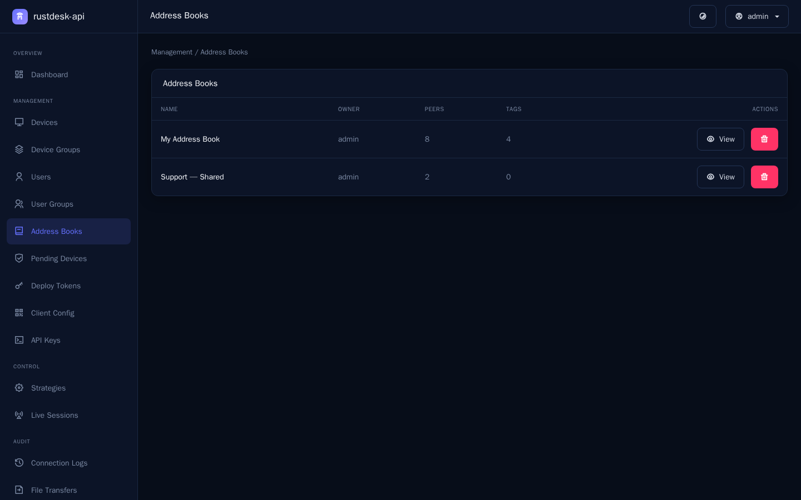
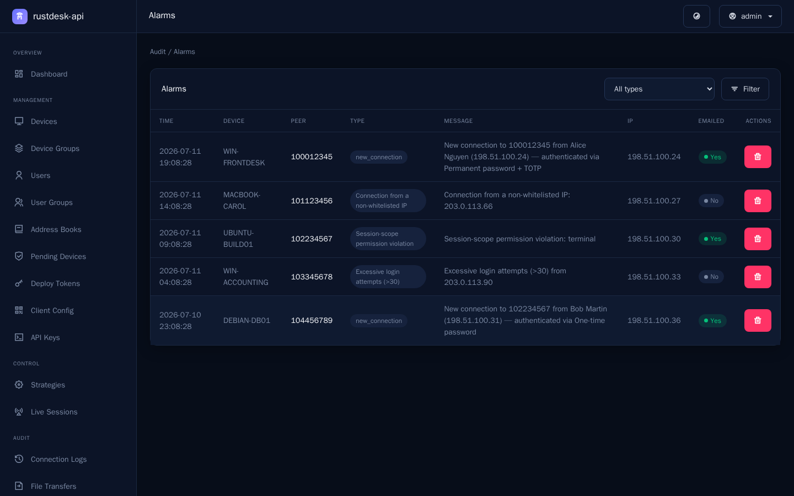
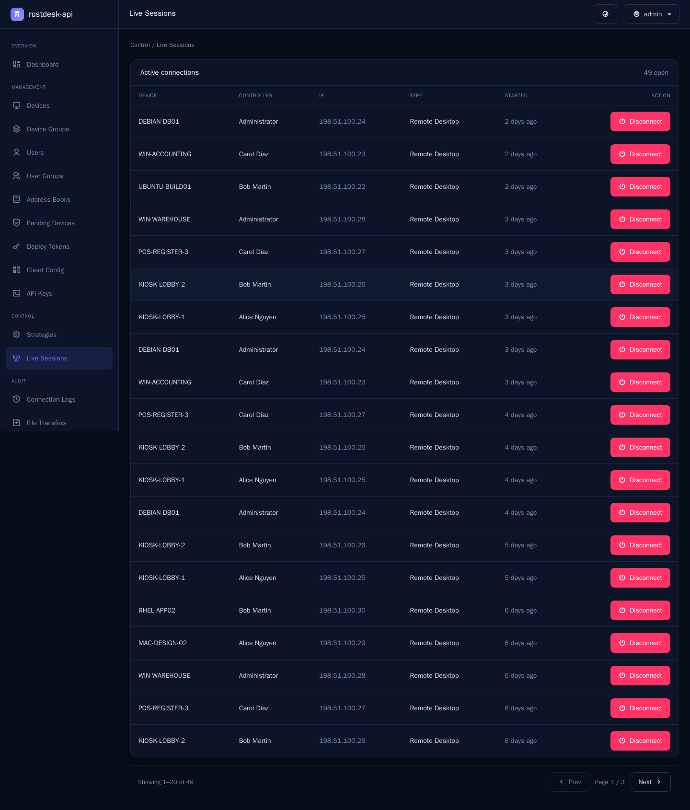
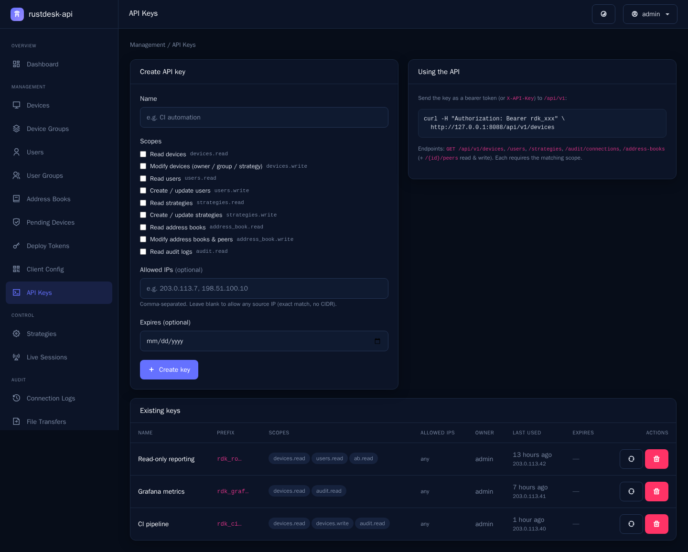
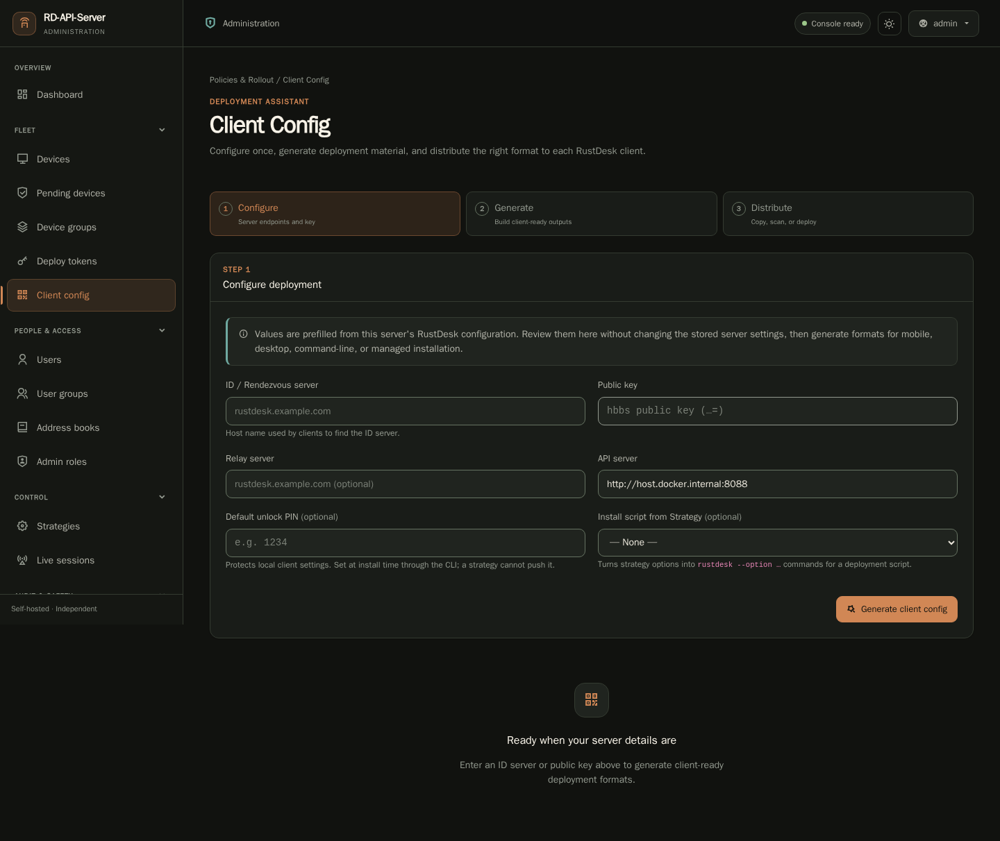

# Screenshots - admin console

A visual tour of the **rustdesk-api** admin console. All data below is **fictional demo data**
generated by [`DemoShowcaseSeeder`](../../database/seeders/DemoShowcaseSeeder.php) using
`example.com` hosts and RFC 5737 IP addresses; no real devices or users are shown.

> Independent, third-party open-source project - **not affiliated with or endorsed by
> RustDesk**.

The capture spec treats `desktop-dark` as the canonical gallery presentation. The gallery was
regenerated and visually reviewed after the 2026-07-13 full WebUI modernization. Desktop light,
tablet dark, and mobile dark behavior
are exercised by the normal Playwright matrix rather than duplicated as a full screenshot
gallery. All CSS, JavaScript, icon fonts, and chart code used during capture are served from
local project assets, so rendering does not depend on a CDN.

## Dashboard

Device and user counts, a 24-hour sessions trend, a 14-day connections/new-devices chart, and
a recent-devices list.


## Devices

Searchable inventory with owner, device group, strategy, OS, version, and live online status,
plus bulk assignment of owner, group, or strategy.


## Strategy (security settings) editor

The signature Strategy editor follows the RustDesk client's Settings organization (General,
Security, and Network), with tri-state toggles, set-all controls, custom keys, and device,
user, or group assignment pushed to clients over heartbeat.


## Address books

Personal and shared/team books with peer and tag counts. Opening a book provides the
RustDesk-client-style manager with peer cards, colored tags, and add/edit dialogs.



## Connection logs (audit)

Connection audit with the RustDesk 1.4.9 additions: an Auth column describing how the session
authenticated (click, one-time/permanent password plus TOTP, or trusted device) and a
controller-attribution indicator.


## Webhooks / notifications

Push alarms and connection/device events to Slack, Telegram, or a generic HMAC-signed JSON
endpoint, with per-hook test and delivery status.


## Alarms

Security and connection alarms for non-whitelisted IPs, session-scope violations, excessive
logins, and new connections with authentication details.



## Live sessions

Currently connected devices with force-disconnect controls.



## API keys

Scoped keys for the admin REST API (`/api/v1`).



## Client config generator

Produce a server-config string, mobile QR code, per-OS `--config` command, and renamed-installer
filename for preconfigured client rollout.



## Regenerating the gallery

Screenshot writing is deliberately guarded, so ordinary Playwright quality-gate runs cannot
overwrite documentation images. From the repository root, use the Docker toolchain and opt in
explicitly:

```bash
docker compose -f docker/compose.toolchain.yml --profile screenshots run --rm \
  -e CAPTURE_SCREENSHOTS=1 screenshots bash docker/demo-shots.sh
```

The profile starts a dedicated `screenshot-db` MariaDB service on tmpfs and forces the
`rustdesk_api_screenshots` database. The `screenshots` runner migrates and seeds only that
isolated database. On a clean checkout it validates that destructive target before installing any
missing dependencies from the Composer and npm lock files, then starts the application and
captures the canonical desktop-dark gallery. It never backs up, restores, or modifies the
persistent development database. The capture definition is
[`e2e/screenshots.spec.ts`](../../e2e/screenshots.spec.ts); it remains skipped unless
`CAPTURE_SCREENSHOTS=1` is present and is not part of the normal CI gate.
